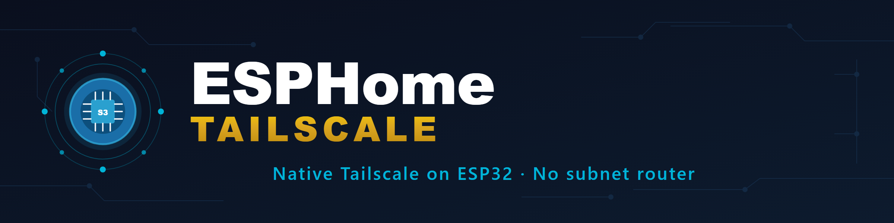
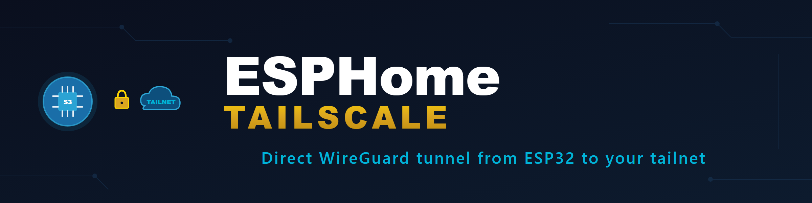
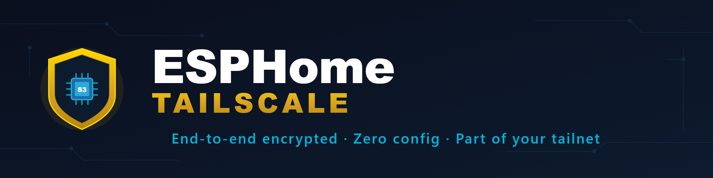
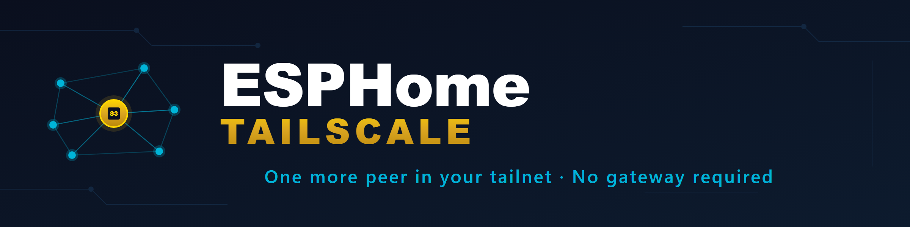
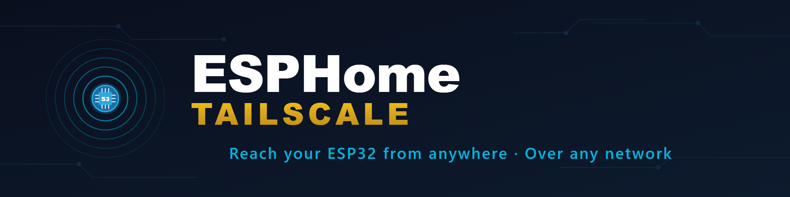
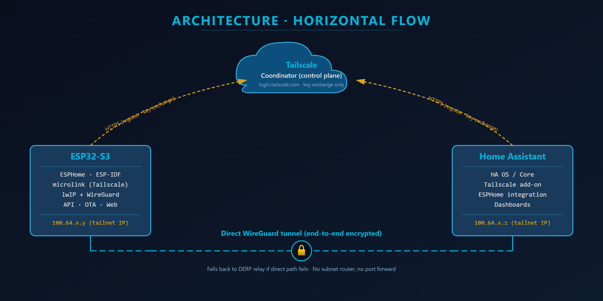
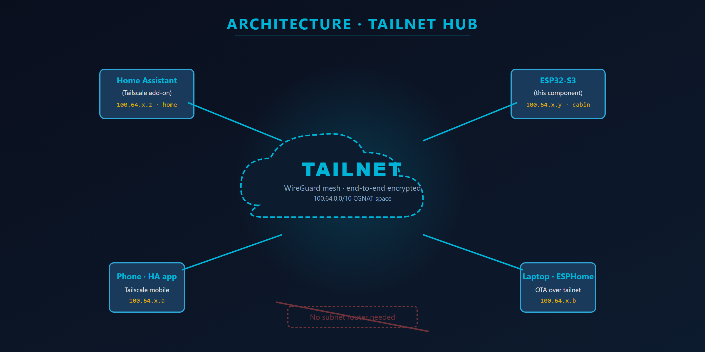
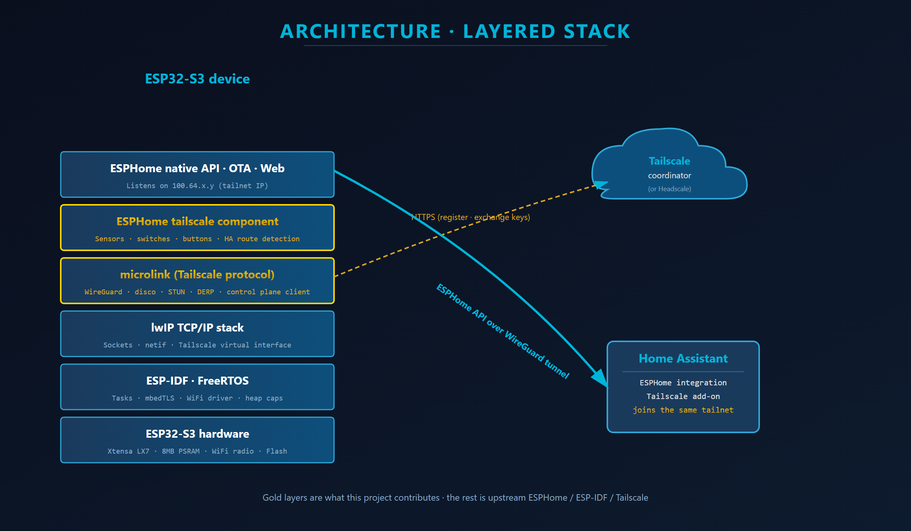

# Hero + Architecture alternatives

Temporary preview page — pick the hero and architecture diagram you want and the rest gets deleted.

## Hero banners (5 options)

### Alt 1 — Chip with concentric tailnet rings

ESP32-S3 chip at the centre with two faint tailnet rings around it, peer dots on the rings. Closest to the existing `ha-mikrotik-extended` / `ha-syncthing-extended` style — a circular emblem on the left, text on the right.

---

### Alt 2 — WireGuard tunnel between chip and tailnet cloud

ESP32 chip on the left, glowing cyan tunnel with a gold padlock in the middle, "TAILNET" cloud on the right. More narrative — shows the connection explicitly.

---

### Alt 3 — Gold shield containing the chip

Shield metaphor — security / VPN vibe. Chip sits inside a gold shield. Heavier gold accent than the others.

---

### Alt 4 — Mesh constellation, chip as gold node

7 peer dots connected as a mesh, ESP32 highlighted in gold at the centre. "One more node in your tailnet" feel.

---

### Alt 5 — Portal / emanating waves

Concentric cyan rings emanating from the chip — broadcast / reach metaphor. Cleanest / most minimal of the five.

---

## Architecture diagrams (3 options)

### Arch Alt 1 — Horizontal flow

ESP32 left, HA right, Tailscale coordinator up top (control plane, dashed gold arrows), direct WireGuard tunnel at the bottom (solid cyan). Shows both planes (control vs data) explicitly. Best for explaining how Tailscale actually works under the hood.

---

### Arch Alt 2 — Tailnet hub

Big dashed tailnet "cloud" in the middle with ESP32, HA, phone, and laptop around it. Crossed-out "No subnet router needed" banner at the bottom. Best for showing "your ESP is just another peer". Less technical, more marketing-style.

---

### Arch Alt 3 — Layered stack

Vertical software stack: hardware → ESP-IDF → lwIP → microlink → tailscale component → ESPHome API. Gold layers highlight what this repo contributes, everything else is upstream. Best for developers and for the "How it works" section of the README.

---

## How to pick

1. Open this file on GitHub (it'll render the SVGs inline).
2. Pick one hero number and one architecture number.
3. Tell me which pair you want, and I'll:
   - Rename the winners to `hero.svg` / `architecture.svg`
   - Delete the other alternatives
   - Wire them into the main README
   - Delete this `ALTERNATIVES.md` file.
